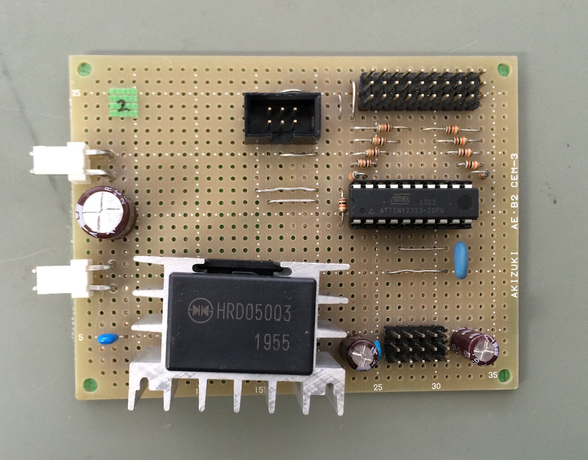

# DOServo
ディジタル出力でサーボモータを動かすための信号変換基板

## IO
- PWM出力 x5
- ディジタル入力 x10
- AVR ISP 書き込みポート

## 仕様

マイコン : AtTiny2313

２つのディジタル入力で１つのPWM出力を制御

一方をHighにするとデューティ比が増加/減少していく

サーボの電源をTPIPではなく外部から供給するための基板でもある

## TODO

- Atmel Studio Project/ Linux等用Makefile を作る
- 回路図等を追加する
- プログラムのリファクタリング（特にPWM生成をがんばっているところをなんとかする）
